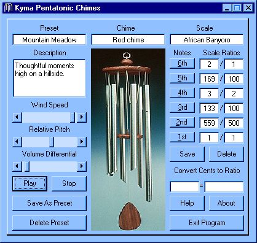



## Kyma Pentatonic Chimes

### Description

Kyma Pentatonic Chimes is a windchime program for

use with DirectX7 or later. It features a pentatonic

scale editor and the ability to save presets for your

chimes. Included in the .zip are bamboo, rod and

tubular chime .wav files, an assortment of scales to

experiment with and some presets for your enjoyment.

Your comments and/or suggestion are invited to:

Michael Hebert

kymasoft@hotmail.com
 
### More Info
 

             |
---                |---
**Submitted On**   |2003-03-30 22:09:34
**By**             |[Mike Hebert](https://github.com/Planet-Source-Code/PSCIndex/blob/master/ByAuthor/mike-hebert.md)
**Level**          |Intermediate
**User Rating**    |5.0 (25 globes from 5 users)
**Compatibility**  |VB 6\.0
**Category**       |[Miscellaneous](https://github.com/Planet-Source-Code/PSCIndex/blob/master/ByCategory/miscellaneous__1-1.md)
**World**          |[Visual Basic](https://github.com/Planet-Source-Code/PSCIndex/blob/master/ByWorld/visual-basic.md)
**Archive File**   |[Kyma\_Penta1576364192003\.zip](https://github.com/Planet-Source-Code/mike-hebert-kyma-pentatonic-chimes__1-44867/archive/master.zip)

